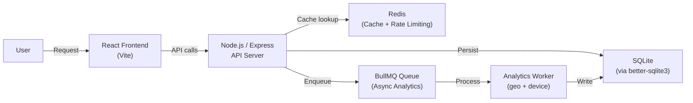

# ShortLinkX 🔗⚡

**Scalable URL Shortening Platform with Real-Time Analytics**

A production-grade URL shortener built to demonstrate backend engineering, system design, caching, DevOps, and frontend dashboards in a single project.

---

## 🏗️ Architecture



**Redirect flow:**
```
User → /:shortCode → Check Redis Cache → Hit: redirect | Miss: SQLite → cache → redirect
                                                         → Enqueue click event asynchronously
```

---

## ✨ Features

| Feature | Details |
|---|---|
| **URL Shortening** | Base62 encoding, custom slugs, expiry dates |
| **Password Protection** | bcrypt-hashed link passwords |
| **QR Codes** | Auto-generated per link, downloadable PNG |
| **Analytics** | Clicks/day, top countries, devices, browsers |
| **Bulk Shortening** | Shorten up to 100 URLs in one request |
| **API Key Auth** | Use the API programmatically without a browser |
| **Rate Limiting** | Tiered limits on shorten + auth endpoints |
| **Async Processing** | BullMQ queue keeps redirects fast |
| **Geo Detection** | geoip-lite resolves country/city from IP |
| **Device Detection** | ua-parser-js breaks down browser & OS |
| **Link Previews** | Automatically fetches Title, Description, and Thumbnail (open-graph-scraper) |
| **Real-Time Analytics** | WebSockets (Socket.io) push click events instantly without refreshing |
| **Smart Expiry Worker** | Background cron (node-cron) auto-cleans expired links |
| **Vanity Domains** | Uses custom subdomains like `s.domain.com` (via `BASE_URL` env var) |

---

## 🚀 Quick Start (Docker Compose)

```bash
# 1. Clone the repo
git clone https://github.com/your-username/shortlinkx.git
cd shortlinkx

# 2. Set secrets (optional – defaults work locally)
cp backend/.env.example backend/.env

# 3. Start all services
docker compose up --build

# Frontend → http://localhost:3000
# Backend  → http://localhost:5000
# Health   → http://localhost:5000/health
```

---

## 🛠️ Local Development (No Docker)

**Prerequisites:** Node.js 20+, Redis running locally

```bash
# Backend
cd backend
npm install
npm run dev       # starts on :5000

# Frontend (new terminal)
cd frontend
npm install
npm run dev       # starts on :3000
```

---

## 📡 API Reference

### Auth
| Method | Endpoint | Body | Auth |
|--------|----------|------|------|
| POST | `/api/auth/register` | `{ email, password }` | — |
| POST | `/api/auth/login` | `{ email, password }` | — |
| GET  | `/api/auth/profile` | — | JWT |

### URLs
| Method | Endpoint | Description | Auth |
|--------|----------|-------------|------|
| POST | `/api/url/shorten` | Shorten a URL | Optional |
| GET  | `/:shortCode` | Redirect | — |
| GET  | `/api/url/user` | List user's URLs | JWT |
| PUT  | `/api/url/edit/:id` | Update link | JWT |
| DELETE | `/api/url/:id` | Disable link | JWT |
| POST | `/api/url/bulk` | Bulk shorten | JWT |

### Analytics
| Method | Endpoint | Description | Auth |
|--------|----------|-------------|------|
| GET | `/api/analytics/summary` | Dashboard totals | JWT |
| GET | `/api/analytics/:shortCode` | Per-link stats | Optional |

**API Key usage:**
```bash
curl -X POST http://localhost:5000/api/url/shorten \
  -H "x-api-key: slx_your_api_key" \
  -H "Content-Type: application/json" \
  -d '{"original_url": "https://example.com"}'
```

---

## 🔧 Environment Variables

### Backend (`backend/.env`)
| Variable | Default | Description |
|---|---|---|
| `PORT` | `5000` | Server port |
| `JWT_SECRET` | — | **Required** signing key |
| `REDIS_URL` | `redis://localhost:6379` | Redis connection |
| `BASE_URL` | `http://localhost:5000` | Public API URL (used in short URLs) |
| `CLIENT_URL` | `http://localhost:3000` | CORS allowed origin |
| `DB_PATH` | `./data/shortlinkx.db` | SQLite file path |

### Frontend (`frontend/.env`)
| Variable | Default | Description |
|---|---|---|
| `VITE_API_URL` | `http://localhost:5000` | Backend API base URL |

---

## 🐳 Docker Images

Multi-stage builds for minimal image sizes:
- **Backend** — `node:20-alpine` builder + runner
- **Frontend** — Vite build → `nginx:alpine` static server

---

## 🔄 CI/CD (GitHub Actions)

`.github/workflows/deploy.yml` pipeline:
1. **Test** — Run `npm test` on the backend
2. **Build** — Docker build + push to GitHub Container Registry
3. **Deploy** — Trigger Render deployment webhooks

**Required GitHub Secrets:**
- `JWT_SECRET`
- `BASE_URL`
- `RENDER_BACKEND_DEPLOY_HOOK`
- `RENDER_FRONTEND_DEPLOY_HOOK`

---

## 🗄️ Database Schema

```sql
users  (id, email, password, api_key, created_at)
urls   (id, original_url, short_code, user_id, expiry_date, password, is_active, click_count, created_at, title, description, image)
clicks (id, short_code, ip_address, country, city, device, browser, os, referrer, clicked_at)
```

---

## 🧰 Tech Stack

| Layer | Technology |
|---|---|
| Backend | Node.js · Express · better-sqlite3 · ioredis · BullMQ · JWT · bcryptjs · Socket.io · node-cron · open-graph-scraper |
| Frontend | React 18 · Vite · Recharts · React Router v6 · Axios · socket.io-client |
| DevOps | Docker · Docker Compose · NGINX · GitHub Actions |
| Analytics | geoip-lite · ua-parser-js |

---

*ShortLinkX – Built to impress in system design interviews.*
